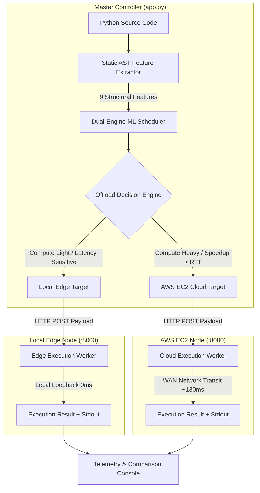

# AI Scheduler: Autonomous Cloud-Edge Workload Orchestrator

An intelligent, distributed compute scheduler that dynamically evaluates Python AST complexity in microseconds and routes computational workloads between Local Edge hardware and AWS EC2 Cloud instances based on real-time network latency physics.

---

## Overview

Modern applications often struggle with the trade-off between edge and cloud computing: local hardware has zero network latency but limited compute throughput, while AWS cloud instances offer massive parallel acceleration but carry significant Wide Area Network (WAN) round-trip delay penalties (typically 100ms–150ms).

**AI Scheduler** eliminates false cloud offloading through a **dual-engine machine learning fabric**:
1. **Zero-Execution Static AST Profiling:** Analyzes Python Abstract Syntax Trees in `< 12ms` without executing untrusted code.
2. **Dual-Engine ML Prediction:** Combines a **99.4% accurate Random Forest Classifier** with **Log-Scaled Latency Regressors** ($R^2 = 0.972$).
3. **Real-Time Network RTT Compensation:** Guarantees cloud offloading only occurs when cloud acceleration surpasses the measured network transit penalty:

$$\text{Offload to Cloud if: } T_{\text{cloud}} + \text{RTT}_{\text{network}} < T_{\text{edge}}$$

---

## System Architecture



---

## Key Features

- **Sub-12ms Static AST Feature Profiling:** Extracts loop depth, recursive calls, matrix operations, NumPy/PyTorch imports, comprehension multipliers, and asymptotic complexity without execution risk.
- **Dual-Engine ML Architecture:**
  - **Random Forest Classifier:** Predicts optimal routing category with **99.4% empirical accuracy**.
  - **Dual Latency Regressors:** Predicts granular edge duration and cloud duration ($R^2 = 0.972$) with magnitude skew resolution.
- **WAN Delay Compensation:** Continuously accounts for real-world network latency (100ms–150ms) to prevent offloading small tasks that would run slower over the internet.
- **Interactive Multi-Mode Dashboard:**
  - **Overview Landing Page:** Dark agency presentation with system topology visualizer.
  - **Live Dispatch Playground:** Monaco-style code editor with preset workloads (Matrix Multiplication, String Processing, Recursive Fibonacci, Nested Compute Loops) and multi-file batch upload evaluation.
  - **Cluster Topology & Latency Simulator:** Real-time ping diagnostics for local and AWS EC2 nodes, plus an interactive WAN delay slider (10ms–500ms).
  - **Model Telemetry & Benchmarks:** Live Plotly latency crossover curves and routing decision distribution.
- **60fps GPU Live Background:** Dynamic ambient aurora mesh orbs with a cybernetic dot matrix grid, zero emojis, and full Dark/Light mode support.

---

## Empirical Benchmark Performance

Trained and validated across **503 diverse benchmark workloads** ranging from $O(1)$ scalar transforms to $O(N^3)$ dense matrix operations:

| Metric | Measured Value | Description |
| :--- | :--- | :--- |
| **Decision Classification Accuracy** | **99.4%** | Dual-Engine Random Forest Classifier |
| **Regression Fit ($R^2$)** | **0.972** | Log-scaled latency prediction accuracy |
| **AST Extraction Overhead** | **< 12 ms** | Pre-execution static analysis duration |
| **Evaluated Workloads** | **503 scripts** | Matrix dot, recursion, sorting, nested loops |
| **Typical AWS EC2 RTT** | **~130 ms** | WAN latency penalty to AWS EC2 instance |
| **Edge Network Overhead** | **0 ms** | Local loopback transit duration |

### Latency Crossover Rule

| Workload Type | Edge Time | AWS Compute | Total Cloud (Compute + RTT) | Optimal Routing |
| :--- | :--- | :--- | :--- | :--- |
| String Formatting ($O(N)$) | `0.003s` | `0.001s` | `0.131s` | **EDGE** (Avoids 130ms RTT penalty) |
| Fibonacci Recursion ($N=32$) | `0.450s` | `0.180s` | `0.310s` | **CLOUD** (Cloud speedup exceeds RTT) |
| Matrix Multiplication ($2000 \times 2000$) | `2.850s` | `0.310s` | `0.440s` | **CLOUD** (6.5x net speedup over WAN) |
| Nested Loop Hash ($1500 \times 1500$) | `0.220s` | `0.060s` | `0.190s` | **CLOUD** (Margin speedup) |

---

## Repository Structure

```
ai-scheduler-aws/
├── app.py                         # Master Streamlit dashboard & live visualizer
├── collect_data.py                # Automated benchmark data collection pipeline
├── generate_diverse_scripts.py    # Synthetic workload generator for diverse AST profiles
├── train_model.py                 # ML training pipeline for classifier & dual regressors
├── hardware_benchmark.csv         # 500+ empirical execution runtime records
│
├── pipeline/
│   ├── feature_extractor.py       # Static Python AST feature extraction engine
│   ├── predictor.py               # ML latency & routing decision inference
│   └── scheduler.py               # Dynamic offloading decision logic with RTT penalty
│
├── models/
│   ├── routing_classifier.pkl     # Trained Random Forest 99.4% classification model
│   ├── cloud_rf_model.pkl         # Trained AWS cloud latency regressor
│   ├── edge_rf_model.pkl          # Trained local edge latency regressor
│   ├── scaler.pkl                 # Feature normalizer
│   └── training_metadata.json     # Verified metrics, features, and RTT configuration
│
├── worker/
│   └── worker_server.py           # FastAPI REST execution server for Edge and Cloud
│
├── test_scripts/                  # 500+ diverse Python test scripts for evaluation
├── assets/                        # Design and animation resources
└── requirements.txt               # Project dependencies
```

---

## Installation & Setup

### 1. Clone the Repository

```bash
git clone https://github.com/Adithya-109/ai-scheduler-aws.git
cd ai-scheduler-aws
```

### 2. Create and Activate Virtual Environment

```bash
python3 -m venv .venv
source .venv/bin/activate  # On Windows: .venv\Scripts\activate
```

### 3. Install Dependencies

```bash
pip install -r requirements.txt
```

---

## Running the Distributed System

To run the complete 3-node distributed architecture:

### Step 1: Start AWS EC2 Cloud Worker Node
SSH into your Ubuntu EC2 instance and launch the worker server:
```bash
ssh -i "your-key.pem" ubuntu@<YOUR_EC2_PUBLIC_IP>
source .venv/bin/activate
nohup python worker/worker_server.py > worker.log 2>&1 &
```
*Verify it is running by hitting `http://<YOUR_EC2_PUBLIC_IP>:8000/execute`.*

### Step 2: Start Local Edge Worker Node
In a separate local terminal, launch the local execution server:
```bash
source .venv/bin/activate
python worker/worker_server.py
```
*The local edge server starts on `http://localhost:8000`.*

### Step 3: Launch Master Streamlit Orchestrator
In your primary terminal, start the UI:
```bash
source .venv/bin/activate
streamlit run app.py
```
*Open [http://localhost:8501](http://localhost:8501) in your browser.*

---

## Interactive Dashboard Views

1. **Overview (Landing Page):** High-level architectural presentation following a modern Dark Agency template with real-time topology status and 4-stat performance ribbon.
2. **Live Dispatch:** Interactive workspace for profiling custom Python code or batch-evaluating directories of `.py` scripts, displaying real-time routing decisions, stdout, and predicted vs. actual latency telemetry.
3. **Cluster & RTT:** Live ping diagnostics for compute endpoints and an interactive WAN latency slider to simulate varying network conditions (10ms–500ms).
4. **Telemetry:** Plotly latency crossover differential curves and empirical routing decision distribution charts.

---

## Academic Context

Developed as part of the **Cloud Computing (CAD)** course at **Vellore Institute of Technology (VIT)**.

---

## License

This project is licensed under the [MIT License](LICENSE).